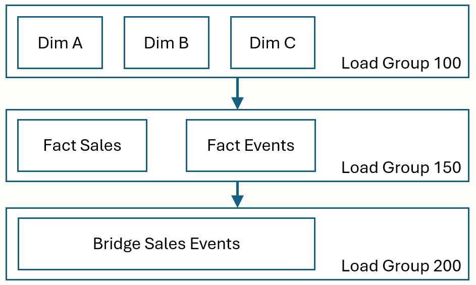

# Schedule Load Groups

The schedule is driven by object priority which determines the order in which tables are synchronized. Priority (defaulted to 100) can be defined as any positive <code>INTEGER</code> within the user configuration.

BQ Objects are synchronized in ascending order of priority starting with zero. Objects that have the same priority (i.e. the default priority which is 100) are grouped together into synchronization groups, called Load Groups, that control the flow of synchronization and allow for parallelism within the asynchronous synchronization process.

Load Groups also function as a mechanism to create dependencies between objects when data is synchronized. An example of this using traditional data warehouse constructs would be to ensure that all dimensions are synchronized prior to loading any fact tables.

When asynchronous operation is enabled, objects within each Load Group are synchronized in parallel. The order that tables within each group is not guaranteed and can be influenced by size of data being synced, configured degree of parallelism (<code>parallelism</code> in the user config) and the configuration of your Spark environment.